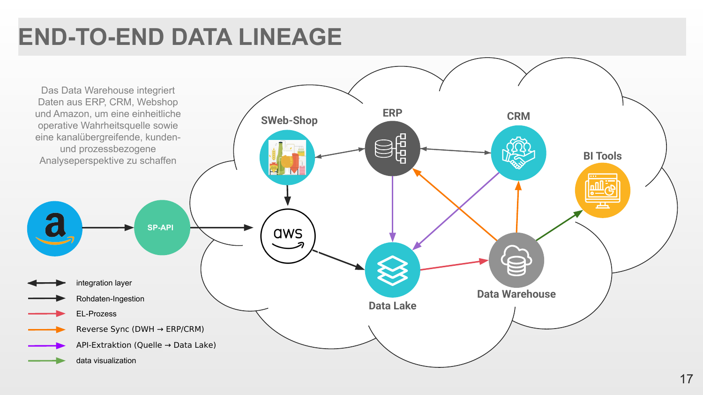

# Swipsti Brauerei – Data-Governance-Strategie & Pilot

**Abschlussprojekt · Beam Institute of Technology (Billigence Data Academy), 2025**
Umgesetzt im internationalen Team mit unterschiedlichen fachlichen Hintergründen.

Präsentationen: [I – Assessment](docs/Swipsti_I_Assessment.pdf) · [II – Implementierung](docs/Swipsti_II_Implementierung.pdf)

## Ausgangslage

Swipsti ist eine mittelständische Brauerei mit 250 Mitarbeitenden. Daten wurden überall genutzt, aber nirgends gesteuert. Die Interviews mit dem Management zeigten:

- **Datensilos:** MES, LIMS, ERP, CRM und Logistiksoftware arbeiteten getrennt – ohne zentrales Data Warehouse oder Data Catalog.
- **Keine Verantwortlichkeiten:** Es gab keine Data Owner oder Data Stewards; die IT verantwortete die Systeme, nicht die Inhalte.
- **Keine gemeinsame Sprache:** „Ausstoß“ bedeutete in Controlling, Produktion und Vertrieb jeweils etwas anderes.
- **Dezentrales Reporting:** Jede Abteilung baute eigene Power-BI-Dashboards; KPIs wurden manuell und oft verspätet konsolidiert.
- **Compliance-Lücken:** Eine externe Datenschutzbeauftragte, aber kein internes Monitoring und kein DSGVO-Verarbeitungsverzeichnis.
- **KI-Ideen ohne Fundament:** Absatzprognose und „Predictive Brewing“ waren angedacht – Strategie, Know-how und Governance fehlten.

## Was wir gemacht haben

1. **Reifegrad-Assessment** – Datenreife über die Governance-Dimensionen bewertet: 2,55 von 5.
2. **Betriebsmodell** – Rollen (Owner, Stewards), RACI, Eskalationswege und Roadmap.
3. **Tool-Auswahl** – Bewertung anhand von 10 Kriterien; Entscheidung für Dataspot (Katalog, Glossar, Datenmodelle).
4. **Pilot-Umsetzung** – fachliches Datenmodell als PostgreSQL-Star-Schema-DWH auf AWS, Data Lineage, Mapping von DSGVO und EU AI Act, KPI-Dashboards in Tableau.

## Ergebnis

- **Reifegrad:** Zielwert von 2,55 auf 3,65 von 5.
- **Governance:** einheitliches Business-Glossar, klare Datenverantwortung, zentral definierte KPIs.
- **Integrierte Datenplattform:** ERP, CRM, Webshop und Amazon (SP-API) fließen in einen Data Lake auf AWS; per EL-Prozess in ein PostgreSQL-Data-Warehouse als kanalübergreifende Single Source of Truth. Bereinigte Daten werden per Reverse Sync an ERP und CRM zurückgespielt.
- **Reporting:** Tableau direkt an das PostgreSQL-DWH angebunden – zentrale KPI-Dashboards statt getrennter Abteilungsberichte.
- **KI-Readiness:** eine gesteuerte Datenbasis für das erste KI-Pilotprojekt.

